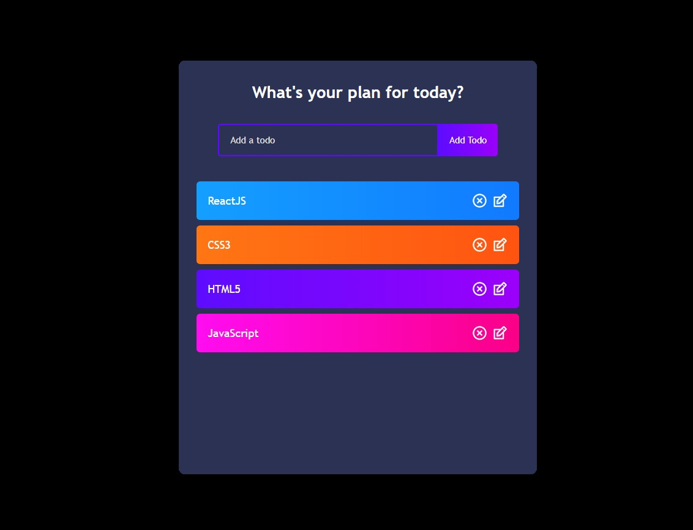

<div id="header" align="center">
  
</div>
<div align="center">
<h2>Hey! <h2>
  <p><i>Ritu Verma</i> here !</p> 
</div>
  
  <div id="badges" align="center">
  <a href="https://www.linkedin.com/in/ritu-verma-52a105228/">
    
  </a>
  <a href="https://www.loom.com/share/ff69c9879d8e4f77b028016795ceb654">
  
  </a>
  <a href="#">
    
  </a>
</div>
  
  ## Getting Started

Clone the repository on your local machine with the command below in your terminal, and cd into the **my-app**

```bash
https://github.com/R-holmes10/TodoList.git

cd my-app
```

Install dependencies (if you are using yarn then do with that)
  ```bash
npm install
```


### `npm start`

Runs the app in the development mode.\
Open [http://localhost:3000](http://localhost:3000) to view it in your browser.


  
  
  <h2>React Todo App</h2>
  <a href ="https://todoapp-react-1xo9.onrender.com"/>
  Live Here
  </a>
 <br>
 </br>

<br></br>


 <b>Languages and Tools used: </b>  
 <div>
  &nbsp;
  &nbsp;
  &nbsp;
  &nbsp;
</div><br>

  
  
  